# Secure webapp

The following implementation workshop was used:

[AWS SERVERLESS APPLICATION MODEL](https://aws.amazon.com/es/getting-started/hands-on/build-serverless-web-app-lambda-apigateway-s3-dynamodb-cognito/)

## Amplify Deploy
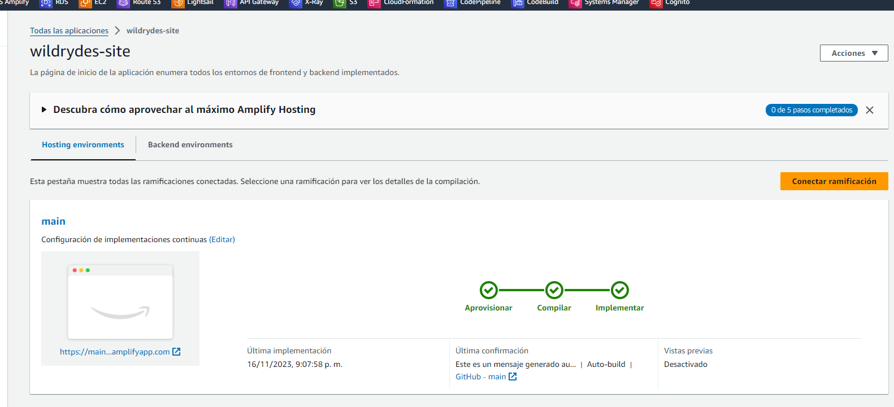
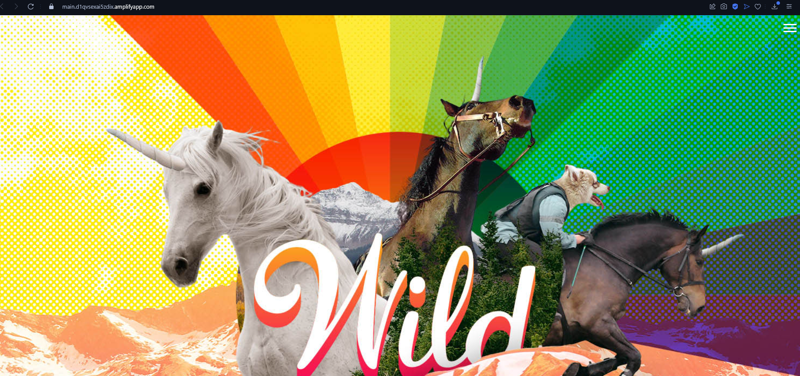

## After cognito integration
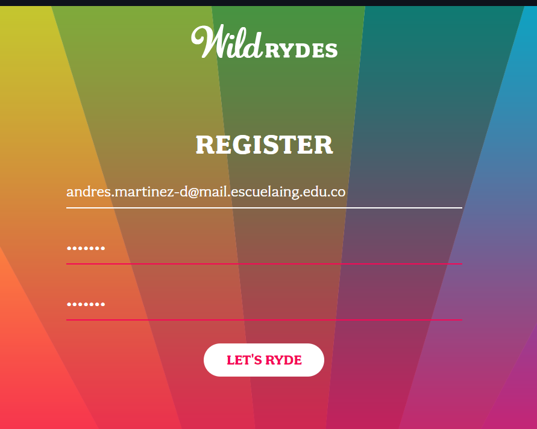
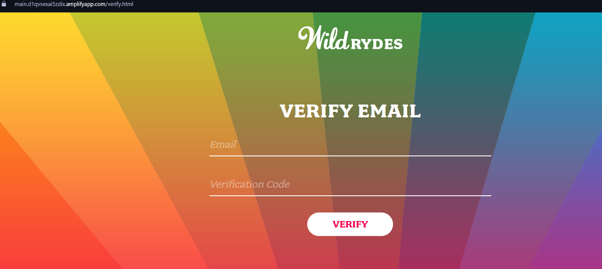
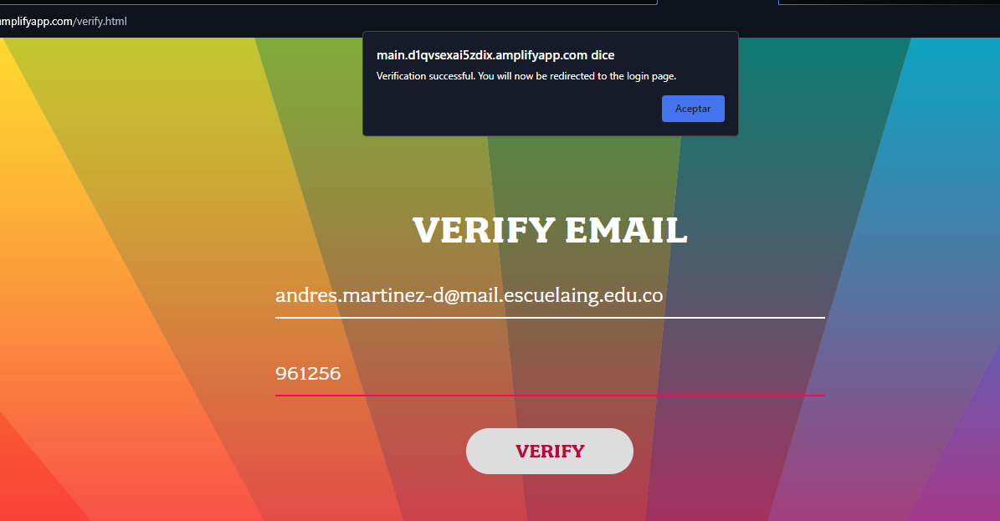

## Dynamo table
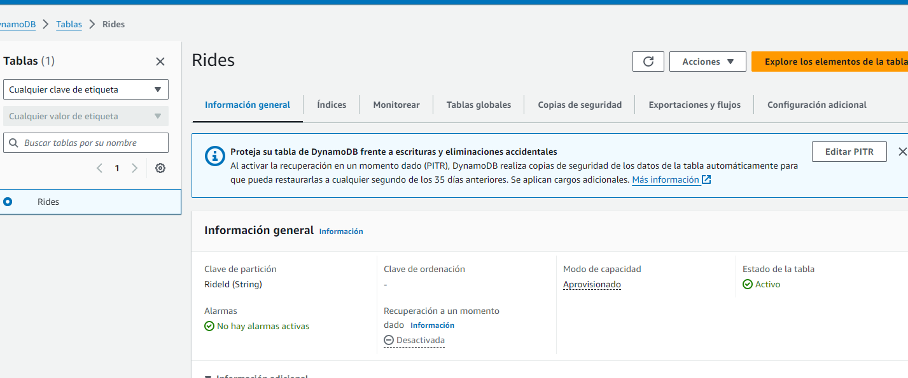

## Lambda Implementation
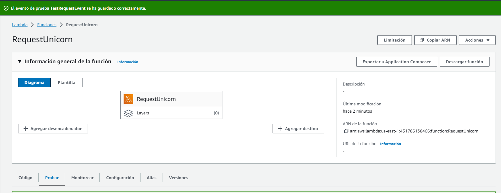
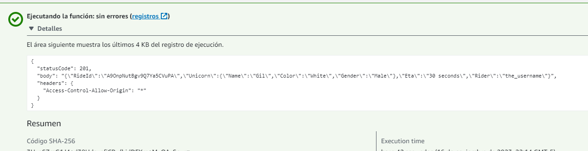

## API Gateway
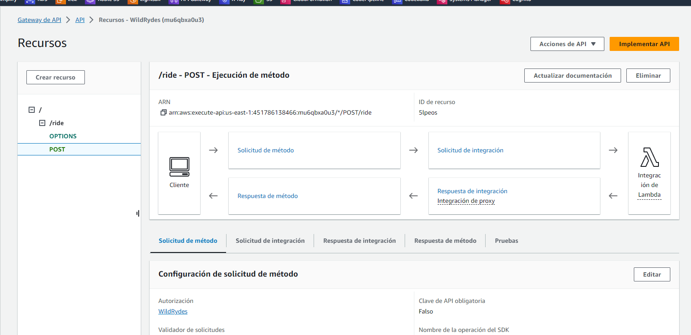

## API integration
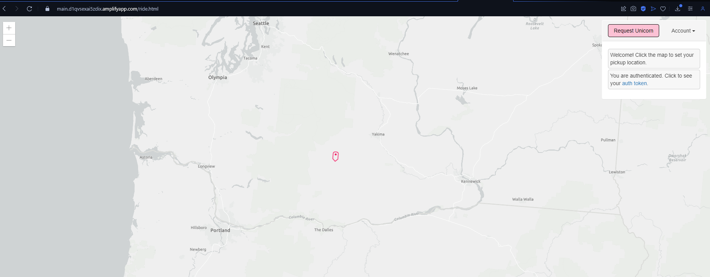
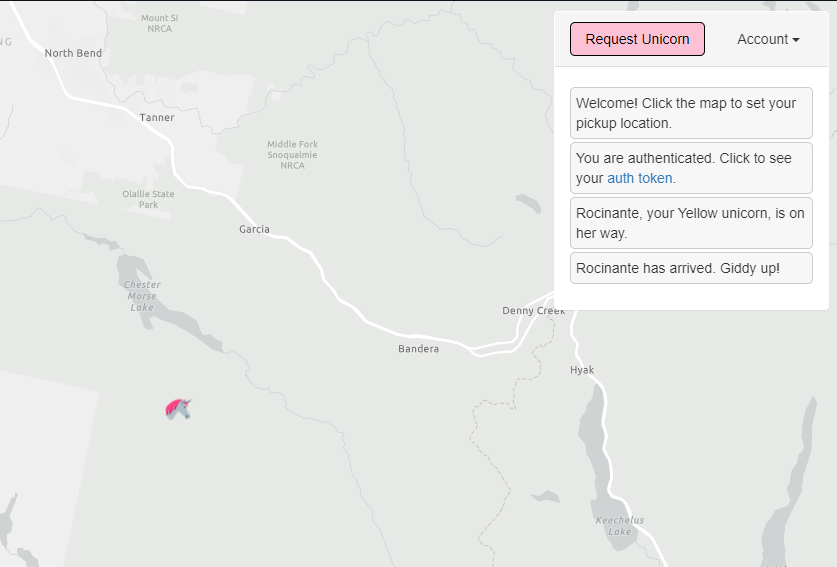

## Visit the page

