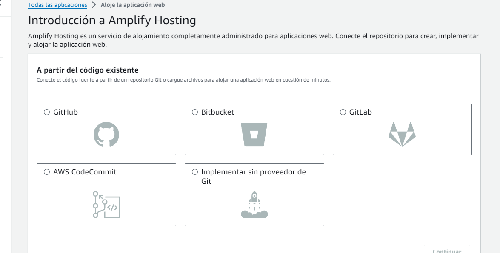
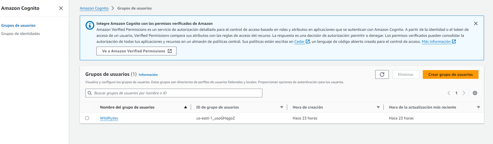
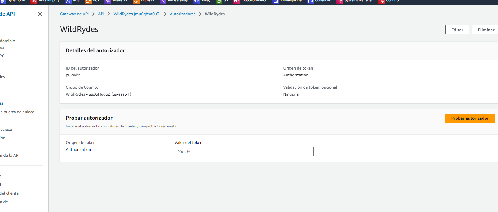

# Secure webapp

Este proyeto consiste en implementar una sencilla aplicación web sin servidor con autenticación, Esta aplicación usá el servicio de AWS cognito para permitir que los usuarios puedan registrarse e ingresar a la aplicación de manera segura.

Este proyecto se realizo gracias a la guía de AWS para [CREAR UNA APLICACIÓN WEB SIN SERVIDOR](https://aws.amazon.com/es/getting-started/hands-on/build-serverless-web-app-lambda-apigateway-s3-dynamodb-cognito/)

## Requisitos

- GIT.
- Una cuenta en GITHUB (También sirven otras plataformas que permiten alojar proyectos utilizando el sistema de control de versiones Git, ).
- Una cuenta de AWS.
- La [AWS CLI](https://docs.aws.amazon.com/cli/latest/userguide/getting-started-install.html) instalada.

## Arquitectura de aplicaciones
La arquitectura de la aplicación utiliza AWS Lambda, Amazon API Gateway, Amazon DynamoDB, Amazon Cognito y la consola de AWS Amplify para construir cada parte de la aplicación.

Y se implementa en 4 pasos:

1. **Alojar un sitio web estático:** configurar AWS Amplify para alojar los recursos estáticos para la aplicación web con implementación continua incorporada.
2. **Administrar usuarios:** crear un grupo de usuarios de Amazon Cognito para administrar la autorización y autenticación del aplicativo.
3. **Crear un backend sin servidor:** Crear un proceso de backend para manejar las solicitudes de la aplicación web e implementarlo en una función de Lambda.
4. **Implementar una API RESTful:** Usando Amazon API Gateway para exponer una función de Lambda como una API RESTful.

## Alojar un sitio web estático
Para este paso se creó un repositorio en github y usando el cliente de AWS en la terminal se trajeron los archivos de un repositorio remoto para enviarlos al repositorio nuevo que fue creado en github, con los siguientes comandos.

```Bash
# Se clona el repositorio nuevo creado en la cuenta de github
git clone https://github.com/Ricar8o/wildrydes-site.git 

# Se accede a la carpeta del repositorio
cd wildrydes-site

aws s3 cp s3://wildrydes-us-east-1/WebApplication/1_StaticWebHosting/website ./ --recursive
```
Con estos comandos ya tendremos todos los recursos en el repositorio remoto de github.

Lo siguiente es ir al servicio de Amplify en la plataforma de AWS, escoger la opción de alojar una aplicación web y nos mostrará para elegir desde donde traeremos el código que se desplegará en la aplicación.



Escogemos github, le damos permiso sobre el repositorio que creamos, escogemos el repositorio y seguimos los demás pasos de la guía para hacer el despliegue. 

Al implementarla realiza los pasos para desplegar la aplicación y nos brinda un link para verla.


## Administrar usuarios
Para la parte de administración de usuarios se siguieron los pasos de la guía para crear un grupo de usuarios en cognito y crear un cliente de aplicación, para pasarle el id del grupo de cognito y la clave de acceso del cliente al aplicativo web en el archivo [config.js](/js/config.js) para que pueda comunicarse con el grupo de usuarios de cognito.

Cognito es quien se encarga de toda la parte lógica de la autenticación de los usuarios y la palicación web solo mostrará los mensajes al cliente.


Después de hacer el cambio en el archivo de configuración, subir los cambios al repositorio remoto y que amplify haya vuelto a desplegar, podremos registrar un usuario.

Después de registrar un usuario, cognito se encarga de enviar un mensaje al correo de registro con el código para verificar el correo.


Al momento de verificar ya se podrá acceder al aplicativo en la página /signin.html con el correo y con la clave creada al momento de hacer el registro.

## Crear un backend sin servidor

### Dynamo
Para almacenar los datos de la aplicación se siguieron los pasos de la guía para acceder al servicio de AWS DynamoDB y crear una tabla llamada Rides. 


### Lambda
Para el backend de la aplicación se siguieron los pasos de la guía para crear una función en AWS Lambda, indicar *Node.js 16.x* como el entorno de ejecución y pegar el siguiente código en la función.

```JavaScript
const randomBytes = require('crypto').randomBytes;
const AWS = require('aws-sdk');
const ddb = new AWS.DynamoDB.DocumentClient();

const fleet = [
    {
        Name: 'Angel',
        Color: 'White',
        Gender: 'Female',
    },
    {
        Name: 'Gil',
        Color: 'White',
        Gender: 'Male',
    },
    {
        Name: 'Rocinante',
        Color: 'Yellow',
        Gender: 'Female',
    },
];

exports.handler = (event, context, callback) => {
    if (!event.requestContext.authorizer) {
      errorResponse('Authorization not configured', context.awsRequestId, callback);
      return;
    }

    const rideId = toUrlString(randomBytes(16));
    console.log('Received event (', rideId, '): ', event);

    // Because we're using a Cognito User Pools authorizer, all of the claims
    // included in the authentication token are provided in the request context.
    // This includes the username as well as other attributes.
    const username = event.requestContext.authorizer.claims['cognito:username'];

    // The body field of the event in a proxy integration is a raw string.
    // In order to extract meaningful values, we need to first parse this string
    // into an object. A more robust implementation might inspect the Content-Type
    // header first and use a different parsing strategy based on that value.
    const requestBody = JSON.parse(event.body);

    const pickupLocation = requestBody.PickupLocation;

    const unicorn = findUnicorn(pickupLocation);

    recordRide(rideId, username, unicorn).then(() => {
        // You can use the callback function to provide a return value from your Node.js
        // Lambda functions. The first parameter is used for failed invocations. The
        // second parameter specifies the result data of the invocation.

        // Because this Lambda function is called by an API Gateway proxy integration
        // the result object must use the following structure.
        callback(null, {
            statusCode: 201,
            body: JSON.stringify({
                RideId: rideId,
                Unicorn: unicorn,
                Eta: '30 seconds',
                Rider: username,
            }),
            headers: {
                'Access-Control-Allow-Origin': '*',
            },
        });
    }).catch((err) => {
        console.error(err);

        // If there is an error during processing, catch it and return
        // from the Lambda function successfully. Specify a 500 HTTP status
        // code and provide an error message in the body. This will provide a
        // more meaningful error response to the end client.
        errorResponse(err.message, context.awsRequestId, callback)
    });
};

// This is where you would implement logic to find the optimal unicorn for
// this ride (possibly invoking another Lambda function as a microservice.)
// For simplicity, we'll just pick a unicorn at random.
function findUnicorn(pickupLocation) {
    console.log('Finding unicorn for ', pickupLocation.Latitude, ', ', pickupLocation.Longitude);
    return fleet[Math.floor(Math.random() * fleet.length)];
}

function recordRide(rideId, username, unicorn) {
    return ddb.put({
        TableName: 'Rides',
        Item: {
            RideId: rideId,
            User: username,
            Unicorn: unicorn,
            RequestTime: new Date().toISOString(),
        },
    }).promise();
}

function toUrlString(buffer) {
    return buffer.toString('base64')
        .replace(/\+/g, '-')
        .replace(/\//g, '_')
        .replace(/=/g, '');
}

function errorResponse(errorMessage, awsRequestId, callback) {
  callback(null, {
    statusCode: 500,
    body: JSON.stringify({
      Error: errorMessage,
      Reference: awsRequestId,
    }),
    headers: {
      'Access-Control-Allow-Origin': '*',
    },
  });
}
```


Después de implementar el código en la función podemos ir a la pestaña de probar y crear un evento con él siguiente contenido.

```JSON
{
  "path": "/ride",
  "httpMethod": "POST",
  "headers": {
    "Accept": "*/*",
    "Authorization": "eyJraWQiOiJLTzRVMWZs",
    "content-type": "application/json; charset=UTF-8"
  },
  "queryStringParameters": null,
  "pathParameters": null,
  "requestContext": {
    "authorizer": {
      "claims": {
        "cognito:username": "the_username"
      }
    }
  },
  "body": "{\"PickupLocation\":{\"Latitude\":47.6174755835663,\"Longitude\":-122.28837066650185}}"
}
```

Al ejecutar la prueba podemos ver que esta funcionando correctamente el código que implementamos en la función


## Implementar una API RESTful
Para esta sección se siguieron los pasos de la guía para crear una API REST en el servicio de AWS API GATEWAY, conectar un endpoint de la API a la función desplegada en AWS Lambda y usar un autorizador que a través del grupo de usuarios de cognito valide que solo un usuario con un token valido pueda realizar la petición al recurso.

Autorizador creado para validar la autorización de los recursos.


Recurso creado para integrar la función lambda con el endpoint.


Después de crear el autorizador, el recurso e integrarlo con la función lambda implementamos el API, al hacerlo nos da un link para invocar el recurso.

Copiamos este link y lo añadimos al archivo [config.js](/js/config.js), confirmamos los cambios, subimos los cambios al repositorio y al deplegar ya tendremos habilitada la función de solicitar un viaje en la aplicación web.


## Visit the page

[](https://main.d1qvsexai5zdix.amplifyapp.com)
